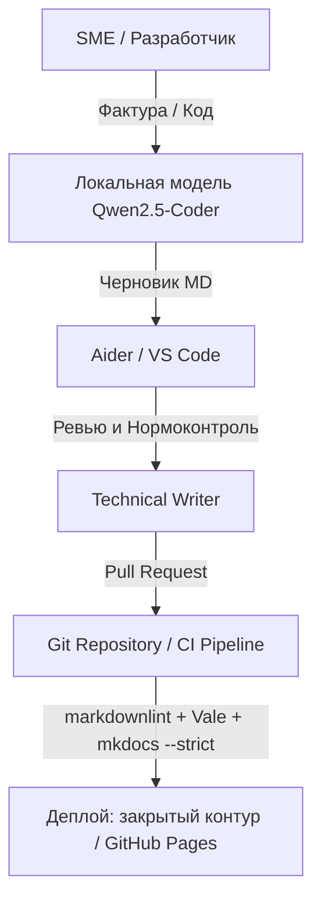

## Локальный AI-контур для документации (NDA / ЗОКИИ)

Схема безопасной работы с черновиками документации в закрытом периметре компании без утечки данных.

### Почему локально, а не в облаке

- **Данные не покидают периметр:** модель крутится на Ollama внутри контура — применимо для NDA и ЗОКИИ (187-ФЗ), нет передачи фактуры во внешние API.
- **Человек в цикле:** архитектура документации, нормоконтроль и верификация — на писателе; агент закрывает рутину (черновики, шаблоны, форматирование).
- **Всё версионируется:** каждый коммит агента — в Git, с Conventional Commits и ревью через PR.
