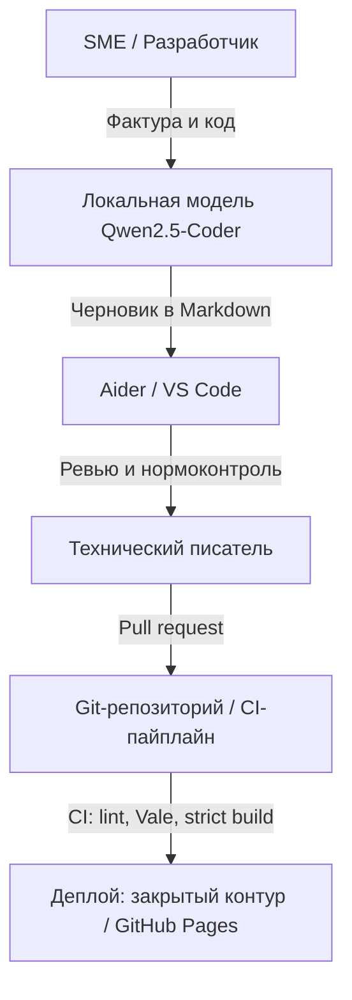

> 🎯 **Live Demo:** https://aidar65.github.io/aidar-technical-writing/
> 📩 **Контакты:** Telegram [@Ambassador_ru](https://t.me/Ambassador_ru) | jaarmakov@bk.ru

## 📊 Ключевые показатели

| Метрика | Значение |
| :--- | :--- |
| Контракты под управлением | **70+ млн ₽** (Росатом: Курская АЭС-2, БРЕСТ-ОД-300) |
| Позиций в конфигурации данных | **3 240** (KKS, ЕОС-Качество, ЕОНКОМ) |
| Процедур нормоконтроля в год | **300+** (ТУ, ТЗ, ПМИ, РЭ по ГОСТ 19/34, ЕСКД, СТО Росатома) |
| Экономия на локализации КД | **до 800 000 ₽** за процедуру (КНР → ЕСКД/РФ без внешнего КБ) |
| Регуляторные проверки | **100%** без замечаний (ПДК ВК, Минпромторг ПП РФ № 719/1875) |

Расшифровки аббревиатур собраны в [глоссарии](reference/glossary.md).

> 🔒 **NDA Disclaimer:** репозиторий — публичный sandbox-портфолио. Основная документация ведётся в закрытых контурах под NDA; кейсы обезличены.

## 🤖 AI-assisted Docs: локальный стек

Черновики документации я генерирую локально на стеке **Ollama + Qwen2.5-Coder + Aider**. Данные не покидают периметр. Это критично для контуров NDA и ЗОКИИ (187-ФЗ).

Модель только готовит черновик. Архитектуру, нормоконтроль и верификацию выполняет технический писатель.

### Локальный AI-контур для документации

Схема показывает, как черновик проходит путь от исходных данных до публикации. Все шаги выполняются внутри закрытого периметра компании.

1. Разработчик или эксперт передаёт фактуру и код локальной модели.
2. Модель Qwen2.5-Coder готовит черновик в Markdown.
3. Технический писатель открывает черновик в Aider или VS Code.
4. Технический писатель проводит ревью и нормоконтроль, затем создаёт pull request.
5. CI проверяет текст линтерами и собирает сайт в строгом режиме.
6. CI публикует документацию в закрытом контуре или на GitHub Pages.
