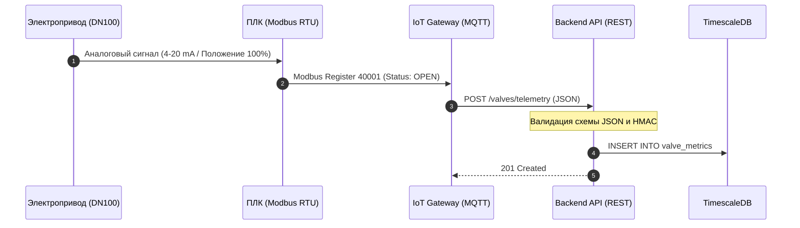

# Архитектура передачи телеметрии с электропривода

Модуль сбора метрик позиционирования и состояния запорной арматуры (DN100, PN25).

---

## Sequence Diagram (Взаимодействие)

```mermaid
sequenceDiagram
    autonumber
    participant Valve as Электропривод (DN100)
    participant Controller as ПЛК (Modbus RTU)
    participant Gateway as IoT Gateway (MQTT)
    participant API as Backend API (REST)
    participant DB as TimescaleDB
    Valve->>Controller: Аналоговый сигнал (4-20 mA / Положение 100%)
    Controller->>Gateway: Modbus Register 40001 (Status: OPEN)
    Gateway->>API: POST /valves/telemetry (JSON)
    Note over API: Валидация схемы JSON и HMAC
    API->>DB: INSERT INTO valve_metrics
    API-->>Gateway: 201 Created
```
