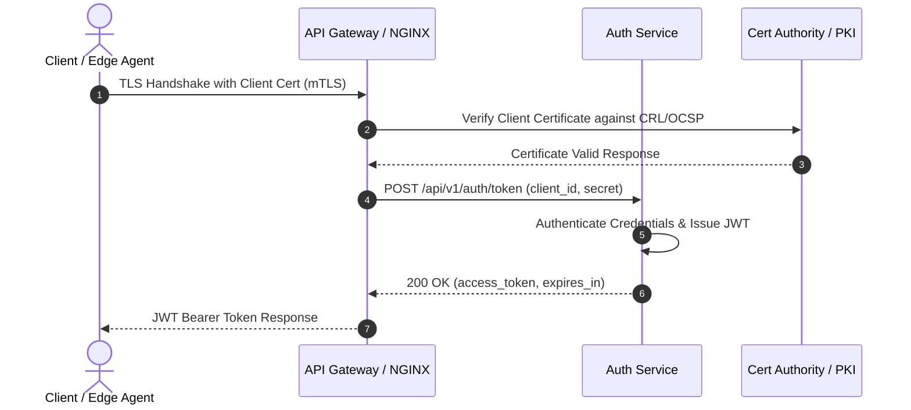

# mTLS-аутентификация и выпустить JWT

В данном документе описана архитектура двухсторонней TLS-аутентификации (mTLS) и взаимодействия клиентского агента с сервисом аутентификации для получения JWT-токена.

## Архитектурное описание

В процессе установления доверенного соединения клиент (`Client / Edge Agent`) предоставляет свой клиентский сертификат шлюзу (`API Gateway / NGINX`). Шлюз проверяет действительность сертификата через Удостоверяющий центр (`Cert Authority / PKI`), используя списки отзыва (CRL) или протокол OCSP. После успешной проверки сертификата клиент запрашивает выпуск токена у сервиса аутентификации (`Auth Service`), который генерирует подписанный JWT для последующих запросов.

## Диаграмма последовательности (Sequence Diagram)

---

## Исходный кодPlantUML

Исходную PlantUML-диаграмму можно найти в файле: [`auth-flow.puml`](auth-flow.puml).
