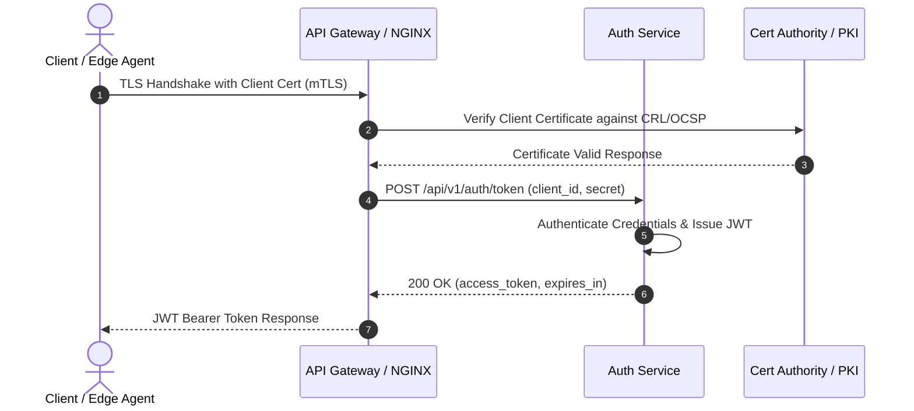

# Sequence-диаграммы: mTLS и аутентификация

В данном документе представлена диаграмма последовательности (Sequence Diagram), описывающая процесс взаимной TLS-аутентификации (mTLS) и последующего получения JWT-токена доступа.

## Сценарий аутентификации и выпуска JWT

1. **Клиент (Edge Agent)** инициирует TLS-соединение с предоставлением клиентского сертификата.
2. **API Gateway (NGINX)** запрашивает у **Удостоверяющего центра (PKI)** валидацию сертификата по спискам CRL / OCSP.
3. После подтверждения валидности сертификата шлюз перенаправляет запрос аутентификации в **Auth Service**.
4. **Auth Service** проверяет учетные данные, генерирует JWT-токен и возвращает его клиенту.

